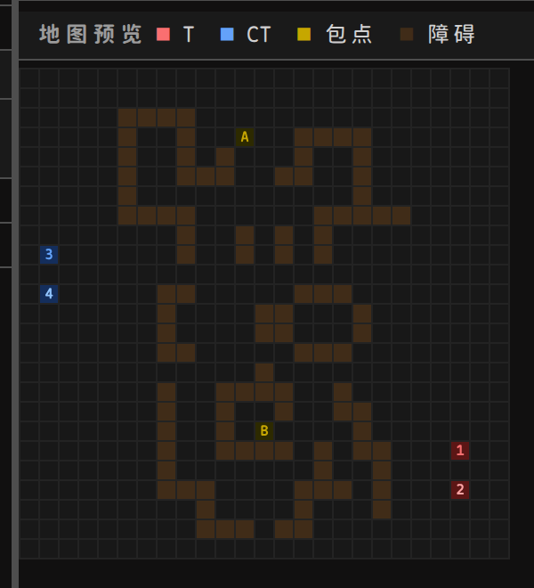

# Asuri Major
## King of the Hill

<div class="text-2xl mt-4 opacity-80">2v2 强化学习对抗赛</div>
<div class="text-lg mt-2 opacity-60">赛题发布会</div>

<style>
.slidev-layout { overflow: hidden; }
</style>

---
layout: default
---

# 赛制一览

<div class="grid grid-cols-3 gap-4 mt-6">

<div class="border border-blue-400 rounded-xl p-4 bg-blue-950 bg-opacity-40">
<div class="text-2xl mb-2">⚔️</div>
<div class="font-bold text-blue-300 mb-1">2v2 对抗</div>
<div class="text-sm opacity-80">进攻方 vs 防守方<br>每队 2 名 AI 代理</div>
</div>

<div class="border border-orange-400 rounded-xl p-4 bg-orange-950 bg-opacity-40">
<div class="text-2xl mb-2">🗺️</div>
<div class="font-bold text-orange-300 mb-1">25×25 战术地图</div>
<div class="text-sm opacity-80">多张地图轮换<br>障碍物遮挡视线与弹道</div>
</div>

<div class="border border-green-400 rounded-xl p-4 bg-green-950 bg-opacity-40">
<div class="text-2xl mb-2">🤖</div>
<div class="font-bold text-green-300 mb-1">纯模型对抗</div>
<div class="text-sm opacity-80">提交 .safetensors 权重<br>不允许运行时通信</div>
</div>

</div>

<div class="grid grid-cols-2 gap-4 mt-4">

<div class="border border-purple-400 rounded-xl p-4 bg-purple-950 bg-opacity-40">
<div class="text-2xl mb-2">💣</div>
<div class="font-bold text-purple-300 mb-1">目标：安包 / 拆弹</div>
<div class="text-sm opacity-80">T 方下包引爆 · CT 方阻止或拆除</div>
</div>

<div class="border border-yellow-400 rounded-xl p-4 bg-yellow-950 bg-opacity-40">
<div class="text-2xl mb-2">📊</div>
<div class="font-bold text-yellow-300 mb-1">ELO 积分排名</div>
<div class="text-sm opacity-80">胜 3 分 · 平 1 分 · 负 0 分</div>
</div>

</div>

---
layout: two-cols
---

# 队伍设定

## 💣 进攻方 T（Attackers）

<div class="mt-3 space-y-2">

<div class="flex items-start gap-2 bg-red-950 bg-opacity-40 rounded-lg p-3 border border-red-500">
<span class="text-xl">🎯</span>
<div>
<div class="font-bold text-red-300 text-sm">胜利目标</div>
<div class="text-xs">将炸弹安放于 A/B 包点，等待 30 步引爆</div>
</div>
</div>

<div class="flex items-start gap-2 bg-red-950 bg-opacity-30 rounded-lg p-3 border border-red-800">
<span class="text-xl">📍</span>
<div>
<div class="font-bold text-red-300 text-sm">出生点</div>
<div class="text-xs font-mono">地图中标注 T 的位置</div>
</div>
</div>

<div class="flex items-start gap-2 bg-red-950 bg-opacity-30 rounded-lg p-3 border border-red-800">
<span class="text-xl">⏱️</span>
<div>
<div class="font-bold text-red-300 text-sm">下包机制</div>
<div class="text-xs">在包点连续 Stay <strong>3 步</strong>完成安包</div>
</div>
</div>

</div>

::right::

<div class="ml-4 mt-14">

## 🛡️ 防守方 CT（Defenders）

<div class="mt-3 space-y-2">

<div class="flex items-start gap-2 bg-blue-950 bg-opacity-40 rounded-lg p-3 border border-blue-500">
<span class="text-xl">🎯</span>
<div>
<div class="font-bold text-blue-300 text-sm">胜利目标</div>
<div class="text-xs">消灭全部 T，或下包后完成拆弹</div>
</div>
</div>

<div class="flex items-start gap-2 bg-blue-950 bg-opacity-30 rounded-lg p-3 border border-blue-800">
<span class="text-xl">📍</span>
<div>
<div class="font-bold text-blue-300 text-sm">出生点</div>
<div class="text-xs font-mono">地图中标注 C 的位置</div>
</div>
</div>

<div class="flex items-start gap-2 bg-blue-950 bg-opacity-30 rounded-lg p-3 border border-blue-800">
<span class="text-xl">⏱️</span>
<div>
<div class="font-bold text-blue-300 text-sm">拆弹机制</div>
<div class="text-xs">在炸弹格连续 Stay <strong>3 步</strong>完成拆弹</div>
</div>
</div>

</div>

</div>

---
layout: two-cols
---

# 地图系统

## 规格与字符含义

<div class="mt-3 text-sm">

固定 **25×25** 网格，坐标 `(row, col)`，左上角为 `(0,0)`

</div>

<div class="mt-3">

| 字符 | 含义 |
|:---:|:---|
| `.` | 空地（可移动） |
| `#` | 障碍物（阻挡移动/视线/弹道） |
| `A` | A 包点 |
| `B` | B 包点 |
| `T` | T 方出生点（恰好 2 个） |
| `C` | CT 方出生点（恰好 2 个） |

</div>

<div class="mt-3 text-xs text-gray-400">
赛事轮次从地图池中随机采样<br>
建议在所有地图上训练以提升泛化
</div>

::right::

<div class="ml-4">

## Dust2 地图预览



</div>

---
layout: default
---

# 地图池

<div class="grid grid-cols-2 gap-5 mt-3">

<div>

## 🧪 测试赛（固定 3 张）

<table class="mt-2 w-full text-xs border-collapse">
<thead><tr class="bg-gray-800 text-gray-300">
<th class="p-1.5 text-left border border-gray-600">#</th>
<th class="p-1.5 text-left border border-gray-600">地图</th>
<th class="p-1.5 text-center border border-gray-600">障碍</th>
<th class="p-1.5 text-center border border-gray-600">A 包点</th>
<th class="p-1.5 text-center border border-gray-600">B 包点</th>
<th class="p-1.5 text-left border border-gray-600">T 出生</th>
<th class="p-1.5 text-left border border-gray-600">CT 出生</th>
</tr></thead>
<tbody>
<tr>
<td class="p-1.5 border border-gray-700 text-gray-400">0</td>
<td class="p-1.5 border border-gray-700 font-bold text-yellow-400">Dust2</td>
<td class="p-1.5 border border-gray-700 text-center">100</td>
<td class="p-1.5 border border-gray-700 text-center font-mono text-red-400">3,11</td>
<td class="p-1.5 border border-gray-700 text-center font-mono text-blue-400">18,12</td>
<td class="p-1.5 border border-gray-700 font-mono text-red-300 text-xs">19,22 / 21,22</td>
<td class="p-1.5 border border-gray-700 font-mono text-blue-300 text-xs">9,1 / 11,1</td>
</tr>
<tr class="bg-gray-900 bg-opacity-50">
<td class="p-1.5 border border-gray-700 text-gray-400">1</td>
<td class="p-1.5 border border-gray-700 font-bold text-yellow-400">Sunset</td>
<td class="p-1.5 border border-gray-700 text-center">72</td>
<td class="p-1.5 border border-gray-700 text-center font-mono text-red-400">9,19</td>
<td class="p-1.5 border border-gray-700 text-center font-mono text-blue-400">9,2</td>
<td class="p-1.5 border border-gray-700 font-mono text-red-300 text-xs">23,10 / 23,11</td>
<td class="p-1.5 border border-gray-700 font-mono text-blue-300 text-xs">1,8 / 1,9</td>
</tr>
<tr>
<td class="p-1.5 border border-gray-700 text-gray-400">2</td>
<td class="p-1.5 border border-gray-700 font-bold text-yellow-400">Cache</td>
<td class="p-1.5 border border-gray-700 text-center">117</td>
<td class="p-1.5 border border-gray-700 text-center font-mono text-red-400">3,10</td>
<td class="p-1.5 border border-gray-700 text-center font-mono text-blue-400">23,11</td>
<td class="p-1.5 border border-gray-700 font-mono text-red-300 text-xs">13,24 / 14,24</td>
<td class="p-1.5 border border-gray-700 font-mono text-blue-300 text-xs">9,1 / 9,2</td>
</tr>
</tbody>
</table>

</div>

<div>

## 🏆 正赛地图池（7 选 5）

<div class="text-xs text-gray-400 mt-1 mb-2">每轮从 7 张地图中随机抽取 5 张进入对局池</div>

<div class="grid grid-cols-4 gap-1.5">
<div class="bg-orange-950 bg-opacity-60 border border-orange-600 rounded-lg p-2 text-center">
<div class="font-bold text-yellow-400 text-xs">Dust2</div>
<div class="text-xs text-gray-400 mt-0.5">100 障碍</div>
</div>
<div class="bg-orange-950 bg-opacity-60 border border-orange-600 rounded-lg p-2 text-center">
<div class="font-bold text-yellow-400 text-xs">Sunset</div>
<div class="text-xs text-gray-400 mt-0.5">72 障碍</div>
</div>
<div class="bg-orange-950 bg-opacity-60 border border-orange-600 rounded-lg p-2 text-center">
<div class="font-bold text-yellow-400 text-xs">Cache</div>
<div class="text-xs text-gray-400 mt-0.5">117 障碍</div>
</div>
<div class="bg-gray-800 border border-gray-600 rounded-lg p-2 text-center">
<div class="font-bold text-yellow-400 text-xs">Ascent</div>
<div class="text-xs text-gray-400 mt-0.5">？</div>
</div>
<div class="bg-gray-800 border border-gray-600 rounded-lg p-2 text-center">
<div class="font-bold text-yellow-400 text-xs">Mirage</div>
<div class="text-xs text-gray-400 mt-0.5">？</div>
</div>
<div class="bg-gray-800 border border-gray-600 rounded-lg p-2 text-center">
<div class="font-bold text-yellow-400 text-xs">Inferno</div>
<div class="text-xs text-gray-400 mt-0.5">？</div>
</div>
<div class="bg-gray-800 border border-gray-600 rounded-lg p-2 text-center">
<div class="font-bold text-yellow-400 text-xs">Split</div>
<div class="text-xs text-gray-400 mt-0.5">？</div>
</div>
</div>

<div class="mt-3 text-xs text-orange-300">
🟧 高亮 = 测试赛已开放地图
</div>

</div>

</div>

<div class="mt-3 bg-blue-950 bg-opacity-40 border border-blue-500 rounded-lg p-2 text-xs">
💡 <strong>训练建议：</strong>用 <code>--maps-dir maps/</code> 在所有地图随机采样，泛化能力比单图过拟合更稳定
</div>

---
layout: default
---

# 回合结构

<div class="grid grid-cols-2 gap-6 mt-4">

<div>

## 关键时间节点

<div class="space-y-2 mt-3">

<div class="flex items-center gap-3 bg-gray-800 rounded-lg p-3">
<div class="text-xl">⏱️</div>
<div>
<div class="font-bold text-sm">最大步数</div>
<div class="text-xs text-gray-400">200 步（炸弹安放后不受此限）</div>
</div>
</div>

<div class="flex items-center gap-3 bg-red-950 bg-opacity-40 rounded-lg p-3 border border-red-800">
<div class="text-xl">💣</div>
<div>
<div class="font-bold text-red-300 text-sm">下包时长</div>
<div class="text-xs text-gray-400">在包点连续 Stay <strong>3 步</strong></div>
</div>
</div>

<div class="flex items-center gap-3 bg-orange-950 bg-opacity-40 rounded-lg p-3 border border-orange-800">
<div class="text-xl">⏰</div>
<div>
<div class="font-bold text-orange-300 text-sm">炸弹计时</div>
<div class="text-xs text-gray-400">安包后 <strong>30 步</strong>倒计时爆炸</div>
</div>
</div>

<div class="flex items-center gap-3 bg-blue-950 bg-opacity-40 rounded-lg p-3 border border-blue-800">
<div class="text-xl">🛡️</div>
<div>
<div class="font-bold text-blue-300 text-sm">拆弹时长</div>
<div class="text-xs text-gray-400">在炸弹格连续 Stay <strong>3 步</strong></div>
</div>
</div>

<div class="flex items-center gap-3 bg-gray-800 rounded-lg p-3">
<div class="text-xl">⚡</div>
<div>
<div class="font-bold text-sm">同步结算</div>
<div class="text-xs text-gray-400">双方同时提交动作，无先手优势</div>
</div>
</div>


</div>

</div>

<div>

## 回合流程

```
🚀 开始
   双方在出生点就位

     ↓ 每步循环

⚡ 双方同时提交动作
   (9 种动作选一)

     ↓ 同步结算

🔍 终局判定
   ├─ 未结束 → 继续
   ├─ 炸弹已安放 → 等待爆炸/拆弹
   └─ 胜负确定 → 结束

🏁 回合结束
   更新 ELO 积分
```

</div>

</div>

---
layout: two-cols
---

# 动作空间

每名角色每步执行 **1 个动作**，共 **9 种**

## 移动动作（0–4）

<div class="mt-2 text-sm">

| 索引 | 动作 | 效果 |
|:---:|:---:|:---|
| `0` | ⬆️ 上移 | row - 1 |
| `1` | ⬇️ 下移 | row + 1 |
| `2` | ⬅️ 左移 | col - 1 |
| `3` | ➡️ 右移 | col + 1 |
| `4` | ⏸️ 停留 | 触发下包/拆弹 |

</div>

<div class="mt-3 bg-yellow-950 bg-opacity-40 border border-yellow-700 rounded-lg p-2 text-xs">
⚠️ 多角色同时争抢同一格，<strong>所有相关移动全部失败</strong>
</div>

::right::

<div class="ml-4">

## 开火动作（5–8）

<div class="mt-2 text-sm">

| 索引 | 动作 | 方向 |
|:---:|:---:|:---:|
| `5` | 🔫 向上开火 | ⬆️ |
| `6` | 🔫 向下开火 | ⬇️ |
| `7` | 🔫 向左开火 | ⬅️ |
| `8` | 🔫 向右开火 | ➡️ |

</div>

<div class="mt-3 space-y-2 text-xs">

<div class="bg-red-950 bg-opacity-30 border border-red-800 rounded-lg p-2">
🎯 <strong>Hit-scan</strong> · 射程 <strong>5 格</strong><br>
命中即死亡 · 遇障碍物停止
</div>

<div class="bg-yellow-950 bg-opacity-40 border border-yellow-600 rounded-lg p-2">
⚡ <strong>动作同步结算</strong><br>
双方同时提交动作 · 允许同步互相击杀（trade）<br>
步内顺序：<strong>先射击判定，后移动结算</strong>
</div>

</div>

<div class="mt-3 bg-gray-800 border border-gray-600 rounded-lg p-2 text-xs">
模型输出 <strong>18 个 logit</strong><br>
前 9 → 角色1 · 后 9 → 角色2<br>
各自 argmax 得动作索引
</div>

</div>

---
layout: default
---

# 核心机制详解

<div class="grid grid-cols-2 gap-4 mt-3">

<div class="space-y-3">

<div class="bg-red-950 bg-opacity-30 border border-red-700 rounded-xl p-3">
<div class="font-bold text-red-300 mb-2 text-sm">💣 下包流程（T 方）</div>
<div class="font-mono text-xs bg-black bg-opacity-30 rounded p-2 mb-2">
站在 A/B 包点 → Stay × 3步 → 安包成功
</div>
<div class="text-xs space-y-1 text-gray-300">
<div>✅ A、B 进度独立，两名 T 可分头推进</div>
<div>✅ 2名T同在包点，进度仍每步只 +1</div>
<div>❌ 移动/开火/离开 → 该包点进度归零</div>
<div>⚡ A、B 同步完成 → A 包点优先</div>
</div>
</div>

<div class="bg-blue-950 bg-opacity-30 border border-blue-700 rounded-xl p-3">
<div class="font-bold text-blue-300 mb-2 text-sm">🛡️ 拆弹流程（CT 方）</div>
<div class="font-mono text-xs bg-black bg-opacity-30 rounded p-2 mb-2">
站在炸弹格 → Stay × 3步 → 拆弹成功
</div>
<div class="text-xs space-y-1 text-gray-300">
<div>✅ 2名CT同时拆弹，进度仍每步只 +1</div>
<div>❌ 中断后进度归零</div>
<div>💡 <code>obs[72/73]</code>=1.0 可直接判断炸弹在 A/B 包点</div>
</div>
</div>

</div>

<div class="space-y-3">

<div class="bg-gray-800 border border-gray-600 rounded-xl p-3">
<div class="font-bold mb-2 text-sm">👁️ 视线系统</div>
<div class="text-xs space-y-1">
<div>✓ 曼哈顿距离 ≤ 10 且无障碍遮挡 → <span class="text-green-400">可见</span></div>
<div>✗ 超距或被遮挡 → <span class="text-red-400">不可见</span></div>
<div>ℹ 视线任意角度，开火仅限 4 个正交方向</div>
</div>
</div>

<div class="bg-yellow-950 bg-opacity-30 border border-yellow-700 rounded-xl p-3">
<div class="font-bold text-yellow-300 mb-2 text-sm">⚠️ 特殊边界规则</div>
<div class="text-xs space-y-1 text-gray-300">
<div>• 安包后 T 全灭 → 对局<strong>不立即结束</strong>，等待爆炸/拆弹</div>
<div>• 下包后双方同归于尽 → CT全灭优先 → <strong>T 胜</strong></div>
<div>• 爆炸与拆弹同一步 → <strong>爆炸优先（T 胜）</strong></div>
</div>
</div>

</div>

</div>

---
layout: default
---

# 胜负判定（按优先级）

<div class="space-y-2 mt-4">

<div class="flex items-center gap-3 bg-red-950 bg-opacity-50 border border-red-500 rounded-xl p-3">
<div class="text-2xl font-bold text-red-400 w-10 text-center">#1</div>
<div class="text-xl">💥</div>
<div class="flex-1">
<div class="font-bold text-red-300">炸弹倒计时归零</div>
<div class="text-xs text-gray-400">即使同一步完成拆弹也以爆炸为准</div>
</div>
<div class="font-bold text-red-400">T 胜</div>
</div>

<div class="flex items-center gap-3 bg-blue-950 bg-opacity-50 border border-blue-500 rounded-xl p-3">
<div class="text-2xl font-bold text-blue-400 w-10 text-center">#2</div>
<div class="text-xl">🛡️</div>
<div class="flex-1">
<div class="font-bold text-blue-300">CT 完成拆弹</div>
<div class="text-xs text-gray-400">拆弹进度达到 3/3</div>
</div>
<div class="font-bold text-blue-400">CT 胜</div>
</div>

<div class="flex items-center gap-3 bg-blue-950 bg-opacity-40 border border-blue-700 rounded-xl p-3">
<div class="text-2xl font-bold text-blue-400 w-10 text-center">#3</div>
<div class="text-xl">☠️</div>
<div class="flex-1">
<div class="font-bold text-blue-300">炸弹未安放时 T 全灭</div>
<div class="text-xs text-gray-400">即使 CT 同时全灭也优先判此条</div>
</div>
<div class="font-bold text-blue-400">CT 胜</div>
</div>

<div class="flex items-center gap-3 bg-red-950 bg-opacity-40 border border-red-700 rounded-xl p-3">
<div class="text-2xl font-bold text-red-400 w-10 text-center">#4</div>
<div class="text-xl">💀</div>
<div class="flex-1">
<div class="font-bold text-red-300">CT 全灭</div>
<div class="text-xs text-gray-400">包括下包后 T 全灭但 CT 也全灭的情形</div>
</div>
<div class="font-bold text-red-400">T 胜</div>
</div>

<div class="flex items-center gap-3 bg-blue-950 bg-opacity-30 border border-blue-800 rounded-xl p-3">
<div class="text-2xl font-bold text-blue-400 w-10 text-center">#5</div>
<div class="text-xl">⏰</div>
<div class="flex-1">
<div class="font-bold text-blue-300">到达 200 步，炸弹未安放</div>
<div class="text-xs text-gray-400">除非同一步 CT 全灭（此时 #4 优先）</div>
</div>
<div class="font-bold text-blue-400">CT 胜</div>
</div>

</div>

---
layout: default
---

# 观测空间（77 维 float32）

<div class="grid grid-cols-3 gap-3 mt-4">

<div class="border border-blue-500 rounded-xl p-3 bg-blue-950 bg-opacity-30">
<div class="text-center font-bold text-blue-300 mb-2 text-sm">角色 1 块（36 维）<br><span class="text-xs font-mono opacity-70">obs[0:36]</span></div>
<div class="text-xs space-y-0.5 font-mono">
<div class="text-green-400">[0] alive</div>
<div>[1] row/24 · [2] col/24</div>
<div class="text-yellow-400">[3-4] Δ到A包点</div>
<div class="text-yellow-400">[5-6] Δ到B包点</div>
<div class="text-purple-400">[7-8] 队友Δ位置</div>
<div class="text-purple-400">[9] teammate_alive</div>
<div class="text-red-400">[10-11] 敌人1Δ位置</div>
<div class="text-red-400">[12] enemy1_visible</div>
<div class="text-red-400">[13-14] 敌人2Δ位置</div>
<div class="text-red-400">[15] enemy2_visible</div>
<div class="text-gray-400">[16-23] 8方向墙距ray</div>
<div>[24] 开火冷却</div>
<div class="text-cyan-400">[25-33] 动作掩码×9</div>
<div class="text-orange-400">[34] BFS到A</div>
<div class="text-orange-400">[35] BFS到B</div>
</div>
</div>

<div class="border border-blue-500 rounded-xl p-3 bg-blue-950 bg-opacity-30">
<div class="text-center font-bold text-blue-300 mb-2 text-sm">角色 2 块（36 维）<br><span class="text-xs font-mono opacity-70">obs[36:72]</span></div>
<div class="text-xs text-gray-400 text-center mt-6">
结构与角色 1 完全相同<br><br>
两名队员<br>共享同一观测向量<br><br>
各自感知自己<br>视角的敌人可见性
</div>
</div>

<div class="border border-orange-500 rounded-xl p-3 bg-orange-950 bg-opacity-30">
<div class="text-center font-bold text-orange-300 mb-2 text-sm">全局信息（5 维）<br><span class="text-xs font-mono opacity-70">obs[72:77]</span></div>
<div class="text-xs space-y-1 font-mono mt-2">
<div class="bg-gray-800 rounded p-1.5">
<div class="text-red-400">[72] site_A_progress</div>
</div>
<div class="bg-gray-800 rounded p-1.5">
<div class="text-yellow-400">[73] site_B_progress</div>
</div>
<div class="bg-gray-800 rounded p-1.5">
<div class="text-blue-400">[74] defuse_progress</div>
</div>
<div class="bg-gray-800 rounded p-1.5">
<div class="text-orange-400">[75] bomb_timer_ratio</div>
</div>
<div class="bg-gray-800 rounded p-1.5">
<div class="text-green-400">[76] remaining_steps</div>
</div>
</div>
</div>

</div>

<div class="mt-3 bg-green-950 bg-opacity-30 border border-green-700 rounded-lg p-2 text-xs">
💡 <code>obs[72]</code>=1.0 表示炸弹在 A 包点，<code>obs[73]</code>=1.0 表示炸弹在 B 包点；未下包时分别代表各包点当前进度比例
</div>

---
layout: two-cols
---

# 模型架构（严格遵守）

## DQN 网络

```python
import torch.nn as nn

class DQN(nn.Module):
    def __init__(self,
                 input_dim=77,
                 output_dim=18):
        super().__init__()
        self.net = nn.Sequential(
            nn.Linear(input_dim, 256),
            nn.ReLU(),
            nn.Linear(256, 256),
            nn.ReLU(),
            nn.Linear(256, output_dim),
        )

    def forward(self, x):
        return self.net(x)
```

<div class="mt-3 bg-green-950 bg-opacity-30 border border-green-700 rounded-lg p-2 text-xs">
✅ 参数量约 <strong>100K</strong>，文件约 <strong>400KB</strong>
</div>

::right::

<div class="ml-4">

## 结构图

```
输入 (batch, 77)
        │
  Linear 77→256
     ReLU
        │
  Linear 256→256
     ReLU
        │
  Linear 256→18
        │
输出 (batch, 18)
  ├─ [0:9]  → 角色1 argmax → 动作
  └─ [9:18] → 角色2 argmax → 动作
```

<div class="mt-4 space-y-2 text-xs">
<div class="bg-red-950 bg-opacity-30 border border-red-700 rounded-lg p-2">
❌ 结构不匹配 → 系统自动拒绝<br>层数、维度、激活函数均不可修改
</div>
<div class="bg-blue-950 bg-opacity-30 border border-blue-700 rounded-lg p-2">
📥 输入：77维观测向量<br>
📤 输出：18个logit，取argmax得动作
</div>
</div>

</div>

---
layout: two-cols
---

# 提交规范

## 保存 & 验证

```python
from safetensors.torch import save_file
from koh.ml.policies import WeightPolicy

# 保存
save_file(model.state_dict(),
          "attack.safetensors")

# 本地验证（强烈推荐！）
ok, msg = WeightPolicy.validate_submission(
    "attack.safetensors"
)
print(ok, msg)  # True, "ok"
```

## 文件要求

<div class="text-sm mt-2 space-y-1">
<div>✅ 格式：<code>.safetensors</code></div>
<div>✅ 大小：≤ 50 MB</div>
<div>✅ attack 与 defense <strong>分别提交</strong></div>
<div>⏱️ 上传冷却：两次间隔 ≥ 5 秒</div>
</div>

::right::

<div class="ml-4">

## API 提交

```python
import requests
BASE = "http://<平台地址>/api"

# 登录
r = requests.post(f"{BASE}/auth/login",
    json={"username": "账号",
          "password": "密码"})
token = r.json()["data"]["token"]
headers = {"Authorization": f"Bearer {token}"}

# 提交进攻模型
with open("attack.safetensors", "rb") as f:
    requests.post(f"{BASE}/submissions",
        headers=headers,
        data={"role": "attack"},
        files={"file": f})

# 提交防守模型
with open("defense.safetensors", "rb") as f:
    requests.post(f"{BASE}/submissions",
        headers=headers,
        data={"role": "defense"},
        files={"file": f})
```

</div>

---
layout: two-cols
---

# Baseline 快速上手

## 训练命令

```bash
# 多图训练（推荐）
python koh_baseline_template.py \
  --role attack \
  --maps-dir maps/ \
  --episodes 3000 \
  --output attack.safetensors

python koh_baseline_template.py \
  --role defense \
  --maps-dir maps/ \
  --episodes 3000 \
  --output defense.safetensors

# 单图训练
python koh_baseline_template.py \
  --role attack \
  --map maps/Dust2.txt \
  --seed 42
```

::right::

<div class="ml-4">

## 本地验证

```python
from koh.game.koh_env import KOHBattleEnv
import numpy as np

env = KOHBattleEnv()
env.reset()

obs = env.get_observation("attack")
assert obs.shape == (77,)
assert obs.dtype == np.float32

result = env.step({
    "attack": (0, 3),
    "defense": (4, 4),
})
print(result["done"])
print(result["winner"])
```

## 下载物清单

<div class="mt-2 text-sm space-y-1">
<div>📄 <code>KOH_rules.md</code> — 规则手册</div>
<div>🐍 <code>koh_env.py</code> — 本地训练环境</div>
<div>🤖 <code>koh_baseline_template.py</code> — Baseline</div>
<div>🗺️ <code>maps/*.txt</code> — 地图文件</div>
</div>

</div>

---
layout: default
---

# 常见错误排查

<div class="grid grid-cols-2 gap-3 mt-4">

<div class="space-y-3">

<div class="bg-red-950 bg-opacity-30 border border-red-700 rounded-xl p-3">
<div class="font-bold text-red-300 text-sm mb-1">❌ only .safetensors files accepted</div>
<div class="text-xs text-gray-400">文件格式错误</div>
<div class="text-xs text-green-400 mt-1">→ 使用 <code>safetensors.torch.save_file()</code></div>
</div>

<div class="bg-red-950 bg-opacity-30 border border-red-700 rounded-xl p-3">
<div class="font-bold text-red-300 text-sm mb-1">❌ invalid weights: size mismatch</div>
<div class="text-xs text-gray-400">模型层数或维度不匹配</div>
<div class="text-xs text-green-400 mt-1">→ 严格使用 DQN(77, 18) with 256×256 隐藏层</div>
</div>

<div class="bg-red-950 bg-opacity-30 border border-red-700 rounded-xl p-3">
<div class="font-bold text-red-300 text-sm mb-1">❌ file too large</div>
<div class="text-xs text-gray-400">文件超过 50 MB</div>
<div class="text-xs text-green-400 mt-1">→ 标准 DQN(77,18) 约 400KB，不应超限</div>
</div>

</div>

<div class="space-y-3">

<div class="bg-yellow-950 bg-opacity-30 border border-yellow-700 rounded-xl p-3">
<div class="font-bold text-yellow-300 text-sm mb-1">⏱️ upload cooldown: wait Xs</div>
<div class="text-xs text-gray-400">提交过于频繁</div>
<div class="text-xs text-green-400 mt-1">→ 两次提交之间等待至少 5 秒</div>
</div>

<div class="bg-orange-950 bg-opacity-30 border border-orange-700 rounded-xl p-3">
<div class="font-bold text-orange-300 text-sm mb-1">❌ HTTP 401 Unauthorized</div>
<div class="text-xs text-gray-400">Token 过期或未携带</div>
<div class="text-xs text-green-400 mt-1">→ 重新调用 <code>/api/auth/login</code> 获取新 token</div>
</div>

<div class="bg-blue-950 bg-opacity-30 border border-blue-700 rounded-xl p-3">
<div class="font-bold text-blue-300 text-sm mb-1">obs.shape != (77,)</div>
<div class="text-xs text-gray-400">观测维度不对</div>
<div class="text-xs text-green-400 mt-1">→ 确认使用官方 <code>koh_env.py</code></div>
</div>

</div>

</div>

---
layout: default
---

# 策略提示

<div class="grid grid-cols-2 gap-4 mt-4">

<div class="bg-red-950 bg-opacity-40 border border-red-500 rounded-xl p-4">
<div class="text-lg font-bold text-red-300 mb-3">⚔️ 进攻方策略</div>
<div class="space-y-2 text-sm">
<div class="flex items-start gap-2"><span class="text-green-400 mt-0.5">✓</span> 两名 T 分头推 A/B，制造压力</div>
<div class="flex items-start gap-2"><span class="text-green-400 mt-0.5">✓</span> 一人下包，另一人掩护开火</div>
<div class="flex items-start gap-2"><span class="text-green-400 mt-0.5">✓</span> 观测 <code>obs[76]</code> 剩余步数，控制节奏</div>
<div class="flex items-start gap-2"><span class="text-green-400 mt-0.5">✓</span> 利用 <code>obs[34-35]</code> BFS 规划最短路径</div>
<div class="flex items-start gap-2"><span class="text-green-400 mt-0.5">✓</span> 下包后即使阵亡炸弹仍会爆炸</div>
</div>
</div>

<div class="bg-blue-950 bg-opacity-40 border border-blue-500 rounded-xl p-4">
<div class="text-lg font-bold text-blue-300 mb-3">🛡️ 防守方策略</div>
<div class="space-y-2 text-sm">
<div class="flex items-start gap-2"><span class="text-green-400 mt-0.5">✓</span> 初期分两人各守一个包点</div>
<div class="flex items-start gap-2"><span class="text-green-400 mt-0.5">✓</span> 观测 <code>obs[72-73]</code> 判断 A/B 下包进度，=1.0 即炸弹位置</div>
<div class="flex items-start gap-2"><span class="text-green-400 mt-0.5">✓</span> 根据 <code>obs[75]</code> 炸弹倒计时比例估算剩余拆弹窗口</div>
<div class="flex items-start gap-2"><span class="text-green-400 mt-0.5">✓</span> 用动作掩码 <code>obs[25-33]</code> 过滤无效动作</div>
<div class="flex items-start gap-2"><span class="text-green-400 mt-0.5">✓</span> 利用 <code>obs[34-35]</code> BFS 距离快速奔赴炸弹包点</div>
</div>
</div>

</div>

<div class="mt-4 bg-yellow-950 bg-opacity-40 border border-yellow-500 rounded-xl p-3 text-sm text-center">
💡 <strong>通用技巧：</strong><code>--maps-dir</code> 多图训练的泛化能力 > 单图过拟合的峰值表现
</div>

---
layout: center
class: text-center
background: https://images.unsplash.com/photo-1542751371-adc38448a05e?w=1920&q=80
---

<div class="text-5xl font-bold mb-6">准备好了吗？</div>

<div class="text-xl text-gray-300 mb-8">训练你的 AI，征服 King of the Hill</div>

<div class="grid grid-cols-3 gap-6 max-w-xl mx-auto mb-8">

<div class="bg-white bg-opacity-10 rounded-xl p-4">
<div class="text-3xl mb-2">📥</div>
<div class="text-sm">下载 Baseline<br>& 地图文件</div>
</div>

<div class="bg-white bg-opacity-10 rounded-xl p-4">
<div class="text-3xl mb-2">🤖</div>
<div class="text-sm">训练你的<br>DQN 模型</div>
</div>

<div class="bg-white bg-opacity-10 rounded-xl p-4">
<div class="text-3xl mb-2">🚀</div>
<div class="text-sm">提交挑战<br>登上排行榜</div>
</div>

</div>

<div class="text-blue-300 font-bold">Asuri Major · KOH 赛题 · 2026</div>
